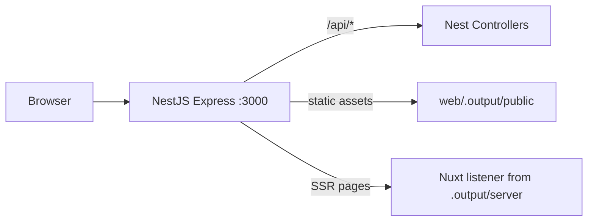

# Architecture

Reference for how NestJS and the chosen frontend share HTTP in a Nodeweaver scaffold.

## Nest + Handlebars + Alpine (`nest-hbs`)

When scaffolding with the full-stack Nest frontend, there is **no** `apps/web`. Nest serves:

| Path | Handler |
|------|---------|
| `/`, `/app` | App-owned `SiteModule` (Handlebars layouts) |
| `/login`, `/logout`, `/forgot-password`, `/reset-password` | Loom site-wide auth (outside `/admin`) |
| `/assets/*` | Shared Loom CSS/JS/branding for the public site |
| `/admin/*` | Loom admin |
| `/api/*` | Nest API (+ Loom JSON API) |

Public and admin UIs share `loom_session`, CSRF, `loom-theme`, and branding. Only the layout differs.

### Subpath hosting (`APP_BASE_PATH`)

Set `APP_BASE_PATH=/my-app` so Nest owns the full prefix (proxy must **not** strip it):

| Surface | Root | Under `/my-app` |
|---------|------|-----------------|
| Home / nest-hbs | `/` | `/my-app` |
| Auth | `/login` | `/my-app/login` |
| Admin | `/admin` | `/my-app/admin` |
| API | `/api/...` | `/my-app/api/...` |
| Session cookie | `Path=/` | `Path=/my-app` |

Example reverse proxy (Caddy / nginx style): forward `https://example.net/my-app/*` → Nest `:4000/my-app/*` (keep the `/my-app` path). Leave `APP_BASE_PATH` empty for domain-root hosting. SPA/SSR scaffolds use the same env for Nuxt `app.baseURL`, Vite `base`, and Angular `--base-href`.

## SPA / SSR frontends (Nuxt, Angular, Vite)

Reference for how NestJS and Nuxt 4 (or other `apps/web` stacks) share a single HTTP port.

## Overview



### Routing contract

| Path | Handler | Mode |
|------|---------|------|
| `/api/*` | NestJS only | prod + dev |
| `/_nuxt/*`, pages, SSR | Nuxt | prod via `listener`, dev via proxy |
| Everything else | Nuxt SSR | prod + dev |

**Rule:** Business APIs live **only** in Nest (`apps/api`). Do **not** add `server/api/` routes in Nuxt — that creates a second backend inside Nitro and breaks routing.

## Repository layout

```
my-app/
├── package.json
├── pnpm-workspace.yaml
├── Dockerfile
├── apps/
│   ├── api/                     # NestJS — HTTP entry point
│   │   └── src/
│   │       ├── main.ts          # bootstrap, prod mount, dev proxy + WS
│   │       ├── app.module.ts
│   │       ├── health.controller.ts
│   │       └── ssr-fallback.controller.ts
│   └── web/                     # Nuxt 4 SSR frontend
│       ├── nuxt.config.ts
│       └── app/pages/
└── packages/
    └── shared/                  # shared types (@repo/shared)
```

## Production flow

1. `pnpm build` runs **Nuxt first**, then Nest
2. Nuxt emits `apps/web/.output/` with `server/index.mjs` exporting `{ listener }`
3. `NODE_ENV=production node apps/api/dist/main.js`:
   - Registers `/api/*` controllers
   - Mounts `express.static(.output/public)`
   - `SsrFallbackController` delegates non-API traffic to the Nitro `listener`

### Nitro preset (required)

```ts
// apps/web/nuxt.config.ts
nitro: {
  preset: 'node-listener',
}
```

The default `node-server` preset starts its own server and does not export `listener`.

### Nest catch-all, not raw `express.use(listener)`

Mounting `listener` via `expressApp.use(listener)` after `app.init()` does not work — Nest's 404 handler intercepts first. Use `SsrFallbackController` with `@All('*')` in production.

### SSR API base URL

During SSR, a relative `$fetch('/api/health')` is handled by Nitro, not Nest → 404.

```vue
// apps/web/app/pages/index.vue
const apiBase = import.meta.server
  ? config.apiBaseServer   // http://127.0.0.1:3000/api
  : config.public.apiBase; // /api (browser, same origin)
```

In dev, Nuxt also proxies `/api/*` to Nest so port `:3001` works for client-side fetches.

## Development flow

| Process | Port | Role |
|---------|------|------|
| Nest | 3000 | User-facing; serves `/api/*`, proxies rest |
| Nuxt | 3001 | Internal; HMR, Vite, Nitro dev |

`pnpm dev` runs both via `concurrently`.

- Dev proxy in `apps/api/src/main.ts` excludes `/api/*`, proxies HTTP to `http://127.0.0.1:3001`
- WebSocket upgrade handler in `main.ts` for Vite HMR
- Vite `hmr.clientPort` is **3001** so HMR connects directly to Nuxt when the app is opened on Nest `:3000` (prevents reload loops)
- Nuxt `devServer.host` must be `127.0.0.1` (not `[::1]`) for the proxy to connect

## Environment variables

| Variable | Default | Used by |
|----------|---------|---------|
| `PORT` | `3000` | Nest listen port |
| `NODE_ENV` | — | `production` enables Nuxt listener |
| `APP_BASE_PATH` | _(empty)_ | Optional mount prefix (`/my-app`); Nest owns the full path |
| `ENABLE_WEB_PROXY` | — | `true` in api dev script |
| `WEB_DEV_URL` | `http://127.0.0.1:3001` | Dev proxy target |
| `API_BASE_SERVER` | `http://127.0.0.1:3000/api` | Nuxt SSR → Nest API |
| `LOOM_BASE_PATH` | `{APP_BASE_PATH}/admin` | Admin URL; override only if needed |

See `.env.example` for a copy-paste template.

## Continuing development

### Add a new API endpoint

1. Add controller/service in `apps/api/src/`
2. Use route prefix `api/...` (e.g. `@Controller('api/users')`)
3. Call from Nuxt with `useFetch(\`${apiBase}/users\`)`
4. Add shared DTOs to `packages/shared` if needed

### Add a new Nuxt page

1. Add `apps/web/app/pages/your-page.vue`
2. SSR data: use `apiBaseServer` on server, `public.apiBase` on client
3. Avoid `server/api/` for business APIs

## Approaches we rejected

| Approach | Why not |
|----------|---------|
| Nest inside Nuxt Nitro plugin | Nitro owns the port |
| Nuxt hosting Nest | Same — wrong owner |
| `node-server` preset + `express.use(listener)` | No `listener` export |
| Duplicate APIs in Nuxt `server/api/` | Two backends |
| Single-process dev without proxy | Loses HMR |

## Smoke tests

```bash
# Production
pnpm build && pnpm start:prod
curl http://localhost:3000/api/health
curl http://localhost:3000/ | grep 'Status:'

# Development
pnpm dev
curl http://localhost:3000/api/health
curl http://localhost:3000/ | grep 'NestJS'
```

## Key files

1. `apps/api/src/main.ts` — entry point, prod/dev branching
2. `apps/api/src/app.module.ts` — dynamic controllers/middleware
3. `apps/web/nuxt.config.ts` — preset, runtimeConfig, devServer, dev API proxy
4. `apps/web/app/pages/index.vue` — SSR fetch pattern
